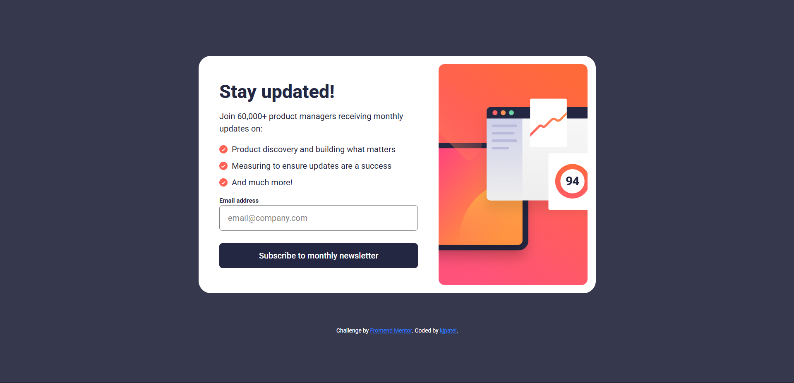

# Newsletter sign-up form with success message solution

This is a solution to the [Newsletter sign-up form with success message challenge on Frontend Mentor](https://www.frontendmentor.io/challenges/newsletter-signup-form-with-success-message-3FC1AZbNrv). Frontend Mentor challenges help you improve your coding skills by building realistic projects. 

## Table of contents

- [Overview](#overview)
  - [Screenshot](#screenshot)
  - [Links](#links)
  - [Built with](#built-with)
  - [What I learned](#what-i-learned)
- [Author](#author)

## Overview

### Screenshot

### Links

- [Live](https://kirtanpatel01.github.io/newletter-signup-form/)

## My process

### Built with

- HTML5
- Tailwind CSS
- Flexbox
- Javascript

### What I learned

I learned a lot about how to handle the click events and according to that change the layout and content on the browser(Without depending too much on AI).

## Author

- Website - [KJ_Patel Portfolio](https://kirtanpatel01.github.io/ARKA_WD_04)
- Frontend Mentor - [@kirtanpatel01](https://www.frontendmentor.io/profile/kirtanpatel01)
- Linkedin - [@kirtapatel01](https://www.linkedin.com/in/kirtanpatel01)
